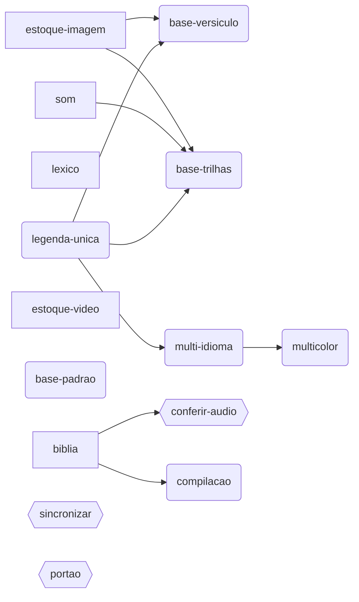

# Jornadas — o que rodar pra conseguir o quê

> ⚠️ **Gerado por `assets/gerar-jornadas.py` a partir de
> `pipeline/modulos/jornadas.py`.** Não edite este arquivo à mão: mexa no
> módulo e rode o script. O módulo também se confere contra a pasta de
> notebooks (`python3 pipeline/modulos/jornadas.py`), então notebook novo que
> ninguém encaixou numa jornada é acusado em vez de sumir do mapa.

São 33 notebooks. A pergunta que se faz na prática nunca é "o que este
notebook faz?" — é a inversa: **"eu quero um resultado assim; o que eu rodo?"**
Este documento responde essa.

Referência de nomes de arquivo, parâmetros e planilhas: `CONFIGURACAO.md`.
Aqui é só o caminho.

## Os três tipos

| Tipo | Frequência |
|---|---|
| **preparo** | uma vez na vida do projeto, ou quando o estoque cresce |
| **vídeo** | uma vez por vídeo |
| **apoio** | quando você quiser; não produz vídeo |

## O que os quatro níveis de vídeo NÃO são

Os quatro níveis (`_video_base` → `_final` → `_final_idiomas` →
`_final_multicolor`) **não são uma cadeia de arquivos**. Os três notebooks de
burn leem todos o mesmo `NOME_VIDEO_BASE`: nenhum queima em cima do mp4 do
nível anterior. Consequências práticas:

- dá pra ir direto ao nível 3 sem nunca gerar o vídeo do nível 1;
- os quatro mp4 convivem na mesma pasta, e nenhum invalida o outro;
- **o que encadeia de verdade são os SRT, não os mp4.** O nível 2 precisa do
  SRT mestre que o `caption-single-generate` produz; o nível 3 precisa dos SRT
  por idioma que o `caption-multilang-generate` produz.

Por isso, abaixo, "depende de" aponta pra jornada cujo **arquivo** é
pré-requisito — não pro "nível de baixo".

## O mapa



`[preparo]` · `(vídeo)` · `{apoio}` — a seta é "precisa do arquivo que aquela produz".

## Preparo — uma vez, ou quando o estoque cresce

### `biblia` — A Bíblia inteira, em áudio e em texto

**Tipo** preparo · **Quando** Uma vez, antes da primeira compilação.

**Entrega** 1.189 mp3 por capítulo em `assets/biblia_audio/` e o texto completo em `dados_lexico/web-biblia.json`.

**Custo** ~1,2 GB e algumas horas de download. Roda e esquece.

| # | Notebook | Produz |
|---|---|---|
| 1 | `biblia-audio-baixar`<br>Renomeia do padrão irregular da fonte pro do projeto. | `assets/biblia_audio/40_Matt_02.mp3` × 1.189 |
| 2 | `biblia-texto-baixar`<br>Confere contra o `40_Matt_02` que já existe antes de dar por bom. | `dados_lexico/web-biblia.json` |

> ⚠️ Depois disso, o passo 'fornecer o áudio' some do fluxo de compilação. Antes disso, toda compilação trava esperando você.

### `som` — Estoque de som — trilha e efeito

**Tipo** preparo · **Quando** Uma vez pra criar as planilhas; de novo sempre que você adicionar arquivos novos às pastas do Drive.

**Entrega** Aba `trilha_stock` da `Biblioteca_Match_Audio` — trilha e efeito no mesmo estoque, separados pela coluna `categoria`.

**Custo** Grátis, sem IA. Não duplica se rodar de novo.

| # | Notebook | Produz |
|---|---|---|
| 1 | `organizar-trilha-audio`<br>Na PRIMEIRA vez ele CRIA as planilhas e imprime os IDs — copie pra configuração, senão cria planilha nova toda vez. | 3 planilhas de trilha + aba `trilha_stock` |
| 2 | `organizar-efeitos-audio`<br>Filtra por tag concreta (porta, trovão, cavalo), não por clima. | linhas de efeito na mesma `trilha_stock` |

### `lexico` — Tags de evento e título na planilha

**Tipo** preparo · **Quando** Uma vez, e de novo quando o léxico ganhar sinônimos.

**Entrega** Abas `evento_tags` e `titulo_tags` na Biblioteca de Match, com o intervalo de cada um visível.

**Custo** Grátis — sem IA, sem Pixabay. Roda a Bíblia inteira de uma vez.

| # | Notebook | Produz |
|---|---|---|
| 1 | `sincronizar-evento-titulo-tags` | abas `evento_tags` e `titulo_tags` |

### `estoque-imagem` — Estoque de imagem, semeado pelo léxico bíblico

**Tipo** preparo · **Quando** Quando a biblioteca não cobre os versículos que você quer usar.

**Entrega** Linhas novas na `pixabay-image-stock` e entradas permanentes na `biblioteca_match`, reaproveitáveis por qualquer vídeo futuro.

| # | Notebook | Produz |
|---|---|---|
| 1 | `pixabay-image-seed`<br>ou `pixabay-image-seed-biblia-completa`<br>Por livro/capítulo, ou os 66 livros de uma vez (esse tem checkpoint: se o Colab cair, continua de onde parou). | linhas novas em `image-stock` |
| 2 | `pixabay-image-descriptions`<br>É `Tags_Semelhantes_*` que o painel de revisão usa pra achar candidato — sem esta etapa o match não acha nada. | tags e descrição de cena preenchidas |

> ⚠️ Entre SEMEAR e ALOCAR você tem que abrir a planilha e apagar as imagens que não servem. Alocar sem revisar imortaliza o lixo.

### `estoque-video` — Estoque de vídeo descrito por IA

**Tipo** preparo · **Quando** Quando entrar clipe novo na `pixabay_stock`.

**Entrega** `Tags_*` e `Descricao_Cena_*` preenchidas na aba `pixabay_stock`.

**Custo** IA de visão (Groq + Mistral em rodízio), 1 a 3 frames por clipe.

| # | Notebook | Produz |
|---|---|---|
| 1 | `pixabay-video-descriptions` | 8 campos preenchidos por clipe |

## Vídeo — uma vez por vídeo

### `base-padrao` — Nível 0 · vídeo base, modo padrão

**Tipo** vídeo · **Quando** Quando a imagem não precisa ter a ver com o versículo — clipes/fotos sorteados, N segundos cada.

**Entrega** `<nome>_video_base[_img].mp4` — narração + fundo + trilha, sem legenda.

**Custo** Cada etapa pula sozinha o que já está feito (checkpoint).

| # | Notebook | Produz |
|---|---|---|
| 1 | `video-base-imagem-padrao`<br>ou `video-base-video-padrao`<br>Imagem parada ou clipe de vídeo — mesma jornada, fundo diferente. | `<nome>_video_base_img.mp4` |

### `base-versiculo` — Nível 0 · vídeo base, imagem casada com o versículo

**Tipo** vídeo · **Quando** Quando cada versículo deve aparecer com a imagem que fala dele.

**Entrega** `<nome>_video_base[_img].mp4` — a imagem troca quando o versículo troca.

**Depende de** `estoque-imagem`, `legenda-unica`

| # | Notebook | Produz |
|---|---|---|
| 1 | `match-scene-verse`<br>Não escreve nada sozinho — é uma lista pra você revisar. Versículo sem candidato sai marcado 'sem opção'. | `match_<nome>_cap<N>.json` + `lacunas_match_*.txt` |
| 2 | `video-base-imagem-versiculo`<br>ou `video-base-video-versiculo` | `<nome>_video_base_img.mp4` |

> ⚠️ Este notebook PARA no meio: rode só a NARRAÇÃO (etapa 6), saia pra rodar o `caption-single-generate` e o `match-scene-verse`, e só então volte pra etapa de cortar os clipes. Ele exige 100% de cobertura do match — para com um relatório dos versículos faltando, não gera vídeo pela metade.

### `base-trilhas` — Nível 0 · vídeo base + trilha por clima, e efeito pontual

**Tipo** vídeo · **Quando** Quando a trilha deve mudar junto com o evento da narrativa, e (na variante com efeitos) quando um versículo pede um som pontual — porta, trovão, cavalo.

**Entrega** `<nome>_video_base[_img].mp4` — mesmo nome canônico dos outros, com trilha por trecho de evento (+ efeitos, na variante).

**Depende de** `estoque-imagem`, `som`, `legenda-unica`

| # | Notebook | Produz |
|---|---|---|
| 1 | `video-base-imagem-versiculo-trilhas`<br>ou `video-base-imagem-versiculo-trilhas-efeitos`<br>Autocontidos: fazem o match cena↔versículo por dentro, não precisa rodar o `match-scene-verse` antes. | `<nome>_video_base_img.mp4` + trilha |

> ⚠️ Mesma interrupção do `base-versiculo`: narração primeiro, `caption-single-generate` fora, volta pro resto. E o pool de candidatas (`TRILHAS_CANDIDATAS`, `EFEITOS_CANDIDATOS`) você escolhe à mão na Configuração — pool vazio dá vídeo sem trilha, sem erro nenhum.

### `legenda-unica` — Nível 1 · legenda única

**Tipo** vídeo · **Quando** O vídeo mais simples que dá pra publicar — e o SRT que ele gera é pré-requisito de quase todo o resto.

**Entrega** `<nome>_final[_img].mp4` + a LEGENDA MESTRE `<nome>_mestre.srt`, que é o contrato de segmentação dos níveis 2 e 3.

| # | Notebook | Produz |
|---|---|---|
| 1 | `caption-single-generate`<br>Já lista onde o Whisper discorda do roteiro do capítulo. Vale baixar, corrigir e resubir com o mesmo nome — Whisper sempre pede uma passada. | `<nome>_whisper_<mestre>.srt` |
| 2 | `caption-single-revisar`<br>Ouvir cada divergência é opcional (só o áudio separa 'o Whisper errou' de 'o Dave leu diferente'; sem ouvir, vale a regra 'faz sentido em inglês? sim fica o Whisper, não vai pro roteiro'). A ÚLTIMA célula não é: é ela que promove o SRT corrigido a `<nome>_mestre.srt`, e é esse arquivo que os níveis 2 e 3 seguem. | as trocas a fazer no SRT + `<nome>_mestre.srt` |
| 3 | `caption-single-burn` | `<nome>_final[_img].mp4` |

> ⚠️ Os três passos precisam de coisas diferentes: o `generate` precisa só da narração (etapa 6 de qualquer notebook de vídeo base), o `burn` precisa do vídeo base pronto. Pros níveis 2 e 3 o pré-requisito é a PROMOÇÃO a mestre (última célula do `revisar`) — o `burn` não é pré-requisito de nada. Sem promover, eles caem no `<nome>_whisper_<mestre>.srt` avisando, que é onde a mestre morava antes de ter nome próprio.

### `multi-idioma` — Nível 2 · legendas multi-idioma, uma cor por idioma

**Tipo** vídeo · **Quando** O vídeo poliglota simples: uma linha por idioma, empilhadas, inglês no topo. Exige um vídeo NO YOUTUBE com dublagem automática — é de lá que sai o texto de cada idioma.

**Entrega** `<nome>_final_idiomas[_img].mp4` + um `<nome>_<lang>.srt` por idioma.

**Depende de** `legenda-unica`

**Custo** Nenhum: nem chave de API nem GPU. A repartição era por IA e hoje é ancorada na GRADE de tempos das legendas do YouTube (as faixas de um mesmo vídeo compartilham a mesma grade, o que dá uma âncora exata entre idiomas), com repartição proporcional de reserva.

| # | Notebook | Produz |
|---|---|---|
| 1 | `caption-multilang-sources-gather`<br>ou `caption-multilang-zh-sources-gather`<br>Pede `URL_YOUTUBE` na Configuração. Duas fontes de texto por idioma; você escolhe qual confia mais em `FONTE_TEXTO_IDIOMA` (o padrão é `yt`, e só ele TEM grade). MANTENHA o idioma mestre na lista: a legenda do YouTube dele é a grade que alinha todos os outros. | `<nome>_yt_<lang>.srt`, `<nome>_audio_<lang>.wav`, `<nome>_whisper_<lang>.srt` |
| 2 | `caption-multilang-generate`<br>ou `caption-multilang-zh-generate` | `<nome>_<lang>.srt` por idioma |
| 3 | `caption-multilang-burn`<br>ou `caption-multilang-zh-burn`<br>A variante `-zh-` grava com sufixo `_zh`, então as duas versões convivem na mesma pasta. | `<nome>_final_idiomas[_img].mp4` |

> ⚠️ O texto dos outros idiomas NÃO é traduzido aqui — é colhido da dublagem automática e das legendas de um vídeo que já está no YouTube (`URL_YOUTUBE`). Num capítulo inédito, você precisa publicar primeiro (pode ser não listado) e esperar o YouTube gerar as faixas. Sem essa URL a jornada não começa.

### `multicolor` — Nível 3 · legenda multicor, uma cor por classe gramatical

**Tipo** vídeo · **Quando** O carro-chefe do canal: cada palavra pintada pela função que exerce na frase.

**Entrega** `<nome>_final_multicolor[_img].mp4`, mais o `.ass`, a classificação por idioma em JSON, a ANÁLISE BRUTA do Stanza/Kiwi e o par de arquivos da revisão (HTML pra achar o erro de cor, CSV pra corrigir).

**Depende de** `multi-idioma`

**Custo** Stanza (latinos) + Kiwi (coreano), CPU. Só na PRIMEIRA vez: o bruto do analisador fica salvo, e rodar de novo remapeia a partir dele em segundos — inclusive aplicando regra de cor que mudou desde então, sem apagar o que você corrigiu à mão.

| # | Notebook | Produz |
|---|---|---|
| 1 | `caption-multicolor-generate`<br>ou `caption-multicolor-zh-generate`<br>Quatro camadas dentro dele: bruto (a origem), mapeamento, central de correções automáticas (`dados_lexico/classes-correcoes.json`) e a sua correção manual pelo CSV. A célula 5 aponta ONDE olhar em vez de pedir que você leia milhares de peças. A variante `-zh-` sai como `legendas_<nome>_zh.ass`. | `legendas_<nome>.ass`, `<nome>_classificacao_multicolor_<lang>.json`, `<nome>_analise_bruta_<lang>.json` e `<nome>_classes_revisar.{html,csv}` |
| 2 | `caption-multicolor-burn`<br>UM notebook serve as duas variantes: ele lê o sufixo `_zh` do nome do `.ass` que você enviar e grava a saída correspondente. Por isso não existe `-zh-burn`. | `<nome>_final_multicolor[_img].mp4` |

> ⚠️ Precisa dos `<nome>_<lang>.srt` do nível 2 — a classificação roda em cima do texto já distribuído por idioma. Se a legenda mudar depois, o bruto e a classificação salvos são DESCARTADOS sozinhos (eles conferem o texto contra o SRT atual): sem isso o vídeo sairia exibindo as palavras da versão anterior, com o SRT novo parado ao lado.

### `compilacao` — Compilação de versículos sortidos

**Tipo** vídeo · **Quando** Quando o vídeo não é um capítulo, e sim uma seleção temática que pula entre livros.

**Entrega** `comp_<tema>.wav` + `.srt` + manifesto `.json`.

**Depende de** `biblia`

**Custo** A transcrição é o caro, e o cache de tempos faz você pagar UMA vez por capítulo, pra sempre. A segunda compilação que usar Salmo 23 pula esse passo.

| # | Notebook | Produz |
|---|---|---|
| 1 | `compilacao-montar` | `comp_<tema>.wav` + `.srt` + manifesto |

> ⚠️ A ordem é a que VOCÊ escreveu na seleção — pode repetir capítulo e sair de ordem de propósito.

## Apoio

### `sincronizar` — Trazer o GitHub pro Drive

**Tipo** apoio · **Quando** Sempre que o repositório mudar — e desconfie se fizer semanas que você não roda.

**Entrega** `pipeline/modulos`, `notebooks` e `dados_lexico` do Drive idênticos ao repositório, conferido por sha256.

**Custo** Segundos. Copia só o que mudou.

| # | Notebook | Produz |
|---|---|---|
| 1 | `repositorio-sincronizar`<br>Mostra o que vai mudar ANTES de mudar, e confere por hash DEPOIS — copiar pra Drive montado falha calado. | Drive igual ao repositório |

> ⚠️ O código vive no GitHub e o Colab lê do Drive; sem esta ponte os dois divergem em silêncio. Em 29/ago o Drive estava 56 commits atrás — faltavam 10 notebooks e 7 módulos. Teste rodado assim executa código velho e falha por motivo que já não existe. A direção é uma só: GitHub → Drive; edição feita direto no Colab e não levada pro git é sobrescrita.

### `conferir-audio` — O áudio fala o mesmo que o texto?

**Tipo** apoio · **Quando** Antes de fazer vídeo de um capítulo novo — e uma vez, pra calibrar o que é normal na sua gravação.

**Entrega** A lista de trechos onde a narração e o texto divergem, ordenada pelo tamanho.

**Depende de** `biblia`

**Custo** Whisper 'small' com GPU: ~1 min por capítulo. A transcrição fica salva num .txt, então recomparar não paga de novo.

| # | Notebook | Produz |
|---|---|---|
| 1 | `biblia-audio-conferir` | `<nome>_whisper_bruto_<modelo>.txt` + o relatório de divergências |

> ⚠️ Whisper 'corrige' texto bíblico pro fraseado da King James -- trocou 'King Herod' por 'Herod the king' no Mateus 2. Reordenar palavra PARECE divergência real e não é. O que decide é a FORMA: muitas diferenças pequenas é ruído, poucas e grandes é divergência. Calibrado em 0,9625 (Whisper 'small') num capítulo cujo texto é comprovadamente o certo -- o PDF oficial do AudioTreasure bate 1,0000 com o web-biblia.json.

### `portao` — Portão de qualidade

**Tipo** apoio · **Quando** Antes de queimar (`.ass`) e antes de publicar (`.mp4`).

**Entrega** Um veredito — não gera arquivo nenhum.

**Custo** A camada do `.ass` é de milissegundos; a do `.mp4`, ~1 min.

| # | Notebook | Produz |
|---|---|---|
| 1 | `portao-qualidade` | relatório aprovado/reprovado |

> ⚠️ Existe pra uma família de bugs que NÃO levanta exceção: cor fora da paleta, glifo faltando, áudio estourado. Rode a camada do `.ass` sempre — ela é de graça.

## Notebook fora de qualquer jornada

| Notebook | Por que fica fora |
|---|---|
| `compilar-versiculos-teste` | Teste de um capítulo só, anterior ao compilacao-montar. Fica até a compilação rodar de verdade em produção (ver nomenclatura.EXCECOES). |

## Conferir o mapa

```
python3 pipeline/modulos/jornadas.py
```

Acusa três coisas que fariam este documento mentir:

| Achado | Significa |
|---|---|
| `[órfão]` | notebook novo na pasta que nenhuma jornada cita |
| `[fantasma]` | jornada citando notebook que foi renomeado ou apagado |
| `[dependência]` | `depende_de` apontando pra jornada que não existe |

## Perguntar ao mapa, em vez de ler

```python
import jornadas as J

J.caminho_ate("multicolor")          # tudo que precisa acontecer antes, em ordem
J.jornadas_de("caption-single-generate")   # em que jornadas este notebook entra
J.por_id("compilacao").armadilha     # o erro que essa jornada costuma provocar
```
